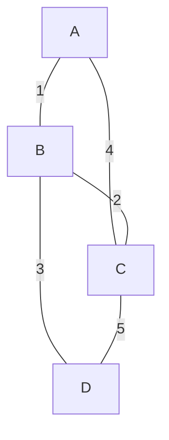

# Distance Vector Routing Explained

Distance Vector Routing is a type of dynamic routing algorithm where routers share their routing tables with their immediate neighbors. Each router maintains a table that lists the "distance" (cost, usually hops) to all known destinations.

**Core Idea:** "I know the path to my neighbors. My neighbors know the path to their neighbors. By sharing our knowledge, we can all build a complete map of the network." This is often summarized as "routing by rumor."

---

## The Bellman-Ford Algorithm in Routing

Distance Vector protocols use the Bellman-Ford algorithm to find the shortest path. The process for each router is:

1. **Initialization:**

    - The distance to itself is 0.
    - The distance to directly connected neighbors is a known cost (e.g., 1 hop).
    - The distance to all other routers is initially set to infinity (∞).

2. **Sharing:**

    - Periodically, each router sends its entire routing table (a "distance vector") to all of its direct neighbors.

3. **Updating (The Bellman-Ford Logic):**
    - When a router (let's call it `A`) receives a distance vector from its neighbor (`B`), it iterates through the destinations in that vector.
    - For each destination (`D`), router `A` calculates a new potential distance: `Cost_to_D_via_B = Cost_from_A_to_B + Cost_from_B_to_D`.
    - `A` then compares this new calculated cost with the existing cost it has for `D` in its own table.
    - **If the new cost is lower**, `A` updates its routing table:
      - The new shortest distance to `D` is `Cost_to_D_via_B`.
      - The next hop to reach `D` is now `B`.

This process repeats until no more updates occur, at which point the tables have converged and are stable.

---

## Example: Building Routing Tables

Let's consider a simple network:

### Initial Routing Tables

Initially, each router only knows about its direct neighbors.

**Router A's Table:**

| Destination | Cost | Next Hop |
| :---------- | :--- | :------- |
| A           | 0    | -        |
| B           | 1    | B        |
| C           | 4    | C        |
| D           | ∞    | -        |

**Router B's Table:**

| Destination | Cost | Next Hop |
| :---------- | :--- | :------- |
| A           | 1    | A        |
| B           | 0    | -        |
| C           | 2    | C        |
| D           | 3    | D        |

### Sharing and Updating

1. **A receives B's table:**
    - **Path to C:** A sees B has a path to C with cost 2. A calculates its path to C via B: `Cost(A->B) + Cost(B->C) = 1 + 2 = 3`. This is **better** than A's current cost of 4. A updates its table.
    - **Path to D:** A sees B has a path to D with cost 3. A calculates its path to D via B: `Cost(A->B) + Cost(B->D) = 1 + 3 = 4`. This is **better** than infinity. A updates its table.

**Router A's Updated Table:**

| Destination | Cost  | Next Hop |
| :---------- | :---- | :------- |
| A           | 0     | -        |
| B           | 1     | B        |
| C           | **3** | **B**    |
| D           | **4** | **B**    |

After a few more exchanges, all tables will stabilize with the shortest paths.

---

## The Count-to-Infinity Problem

This is a major drawback of Distance Vector routing. It occurs when a link fails, and the routers slowly increment their costs to a destination until they reach "infinity."

**Scenario:**

1. The link between `B` and `D` in our example goes down. `B`'s cost to `D` becomes ∞.
2. Before `B` can inform `A`, `A` sends its table, advertising it can reach `D` with a cost of 4 (via `B`).
3. `B` sees this and thinks, "Oh, `A` has a path to `D`! I can get to `A` in 1 hop, so my new path to `D` is via `A` with a cost of `1 + 4 = 5`." `B` updates its table.
4. In the next update, `A` sees `B`'s cost to `D` is now 5. `A`'s path to `D` is through `B`, so it updates its cost to `1 + 5 = 6`.
5. This continues, with `A` and `B` feeding each other bad information, and the cost to `D` slowly "counts to infinity."

### Solution: Split Horizon

A simple solution is **Split Horizon**. The rule is:

> A router does not advertise a route back to the neighbor from which it learned the route.

In our example, since `A` learned its route to `D` from `B`, it would **not** advertise its path to `D` in the updates it sends to `B`. This prevents `B` from creating the routing loop in the first place.
