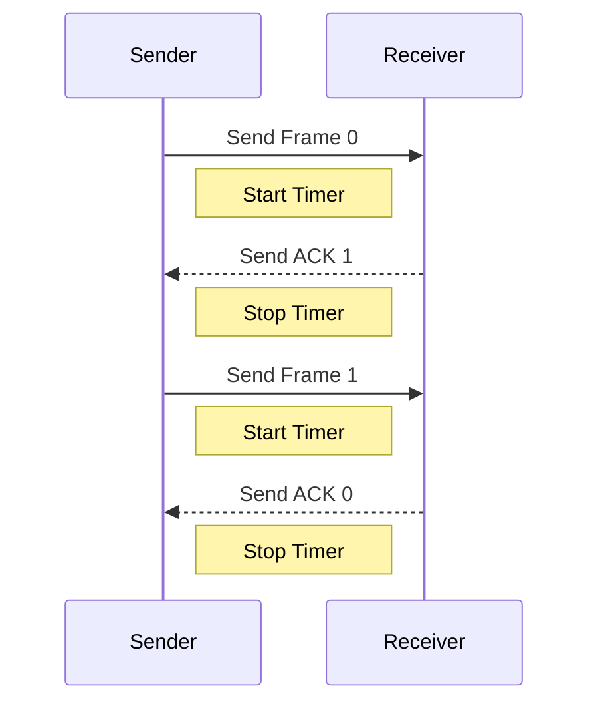
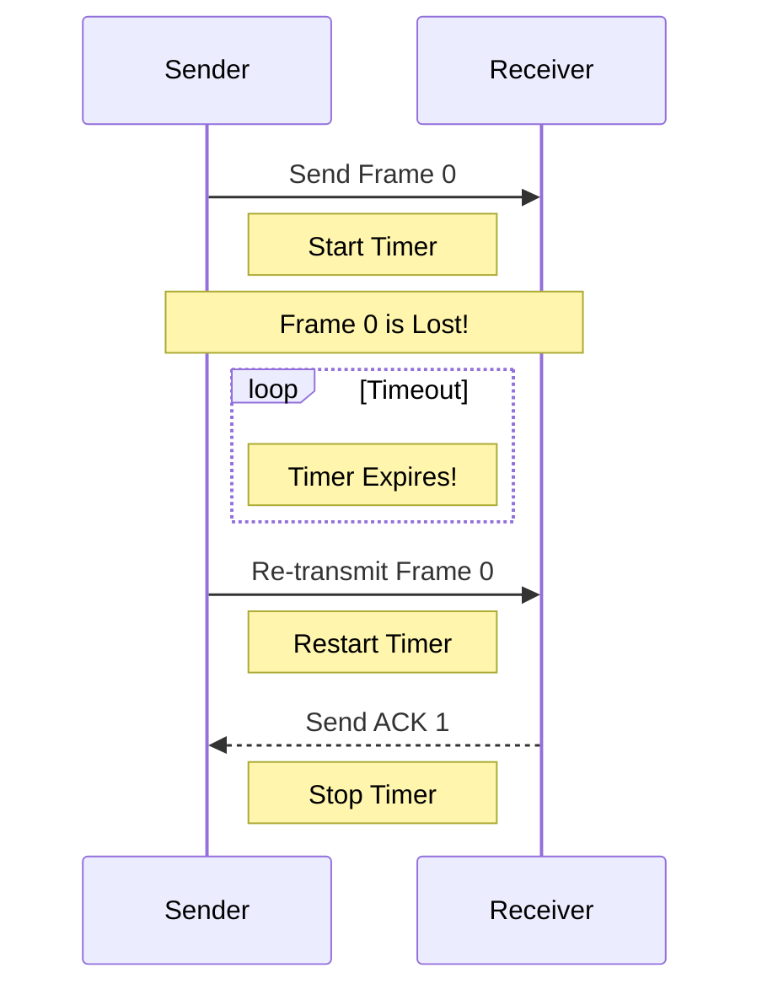
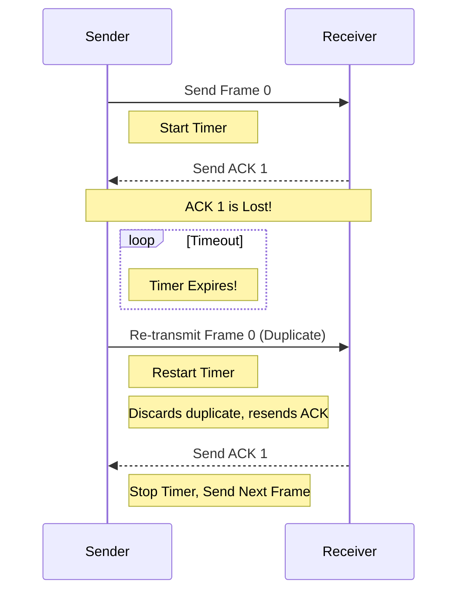

# Flow Control: Stop-and-Wait ARQ Explained

**Flow Control** is the process of managing the rate of data transmission between two nodes to prevent a fast sender from overwhelming a slow receiver. **ARQ (Automatic Repeat Request)** is an error-control method that uses acknowledgements (ACKs) and timeouts to ensure reliable data transmission.

**Stop-and-Wait ARQ** is the simplest form of ARQ for flow and error control.

**Core Idea:** The sender sends one frame at a time and then waits for an acknowledgement (ACK) from the receiver before sending the next frame.

---

## The Basic Mechanism

1.  **Sender:** Sends a single data frame (e.g., Frame 0) and starts a timer.
2.  **Receiver:** Receives the frame. If it's not an error, it sends an ACK back to the sender (e.g., ACK 1, acknowledging Frame 0 and expecting Frame 1 next).
3.  **Sender:** Receives the ACK, stops the timer, and sends the next frame in the sequence (Frame 1).
4.  This process repeats.

---

## Handling Errors

The most important part of Stop-and-Wait ARQ is how it handles errors. There are two primary scenarios: a lost data frame and a lost ACK.

### Scenario 1: Lost Data Frame

If a data frame is lost in transit, the receiver never gets it and therefore never sends an ACK.

**Process:**
1.  **Sender** sends Frame 0 and starts its timer.
2.  The frame is lost. The **Receiver** does nothing because it received nothing.
3.  The **Sender's** timer expires.
4.  Since the Sender did not receive an ACK for Frame 0, it assumes the frame was lost and **re-transmits** Frame 0.
5.  The Receiver gets the re-transmitted Frame 0 and sends ACK 1. The process continues.

**Diagram:**

### Scenario 2: Lost Acknowledgement (ACK)

If the data frame is successfully received, but the ACK sent back by the receiver is lost.

**Process:**
1.  **Sender** sends Frame 0 and starts its timer.
2.  **Receiver** correctly receives Frame 0 and sends ACK 1.
3.  The ACK is lost in transit.
4.  The **Sender's** timer expires because it never received ACK 1.
5.  The Sender assumes the original frame was lost and **re-transmits Frame 0**.
6.  The **Receiver** gets a duplicate copy of Frame 0. Because it was expecting Frame 1, it knows this is a duplicate. It **discards the duplicate frame** and sends ACK 1 again.
7.  The Sender receives ACK 1 and finally sends Frame 1.

**Diagram:**

---

## Disadvantage of Stop-and-Wait

The main drawback of Stop-and-Wait ARQ is its **inefficiency**. The sender has to wait for an ACK after every single frame. If the network has a long round-trip time, the sender spends most of its time idle, waiting for ACKs, leading to very low link utilization. This is why more advanced protocols like Go-Back-N and Selective Repeat were developed.
