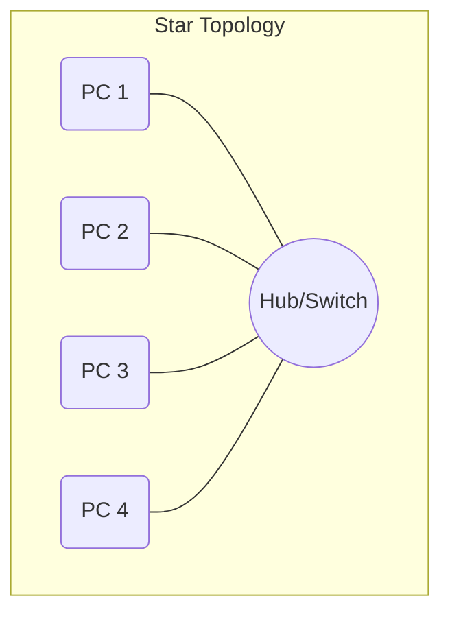
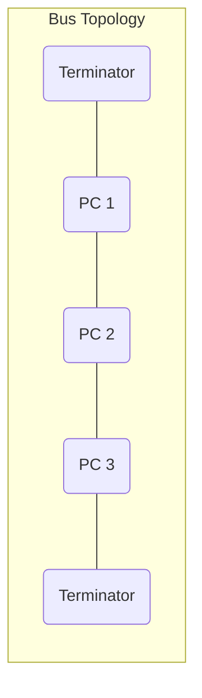
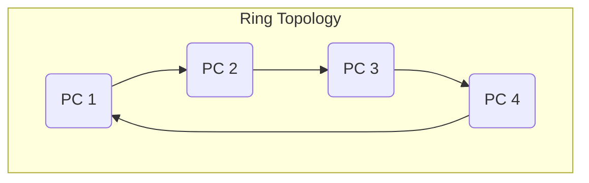

# Switching and Topologies Explained

## Part 1: Switching Methods

In networking, switching refers to how a network moves data from a source to a destination. The two classical switching methods are Circuit Switching and Packet Switching.

### Circuit Switching

**Concept:** A dedicated, physical connection (a "circuit") is established between two nodes before they can communicate. This connection remains active for the entire duration of the conversation.

**Analogy:** A traditional phone call. The line is exclusively yours until you hang up.

**Process:**

1. **Connection Setup:** A dedicated path is reserved from source to destination. This causes an initial delay.
2. **Data Transfer:** Data is transferred at a guaranteed, constant rate.
3. **Connection Teardown:** The circuit is terminated, and the resources are released.

**Key Characteristics:**

- **Dedicated Path:** Resources are not shared.
- **Guaranteed Bandwidth:** No congestion once the connection is made.
- **High Reliability:** Data arrives in the correct order.
- **Inefficient:** Resources are wasted if no data is being sent (e.g., silence during a phone call).
- **Example:** Public Switched Telephone Network (PSTN).

### Packet Switching

**Concept:** Data is broken down into small blocks called "packets." Each packet is sent independently through the network, and they are reassembled at the destination.

**Analogy:** Sending a book through the mail by mailing each chapter separately. Each chapter might take a different route, but they all end up at the same destination to be put back together.

**Process:**

1. **Data is Packetized:** The message is divided into packets, each with a header containing destination information.
2. **Store and Forward:** Packets are sent from one router to the next. Each router receives a full packet, stores it briefly, and then forwards it to the next hop.
3. **No Dedicated Path:** Packets can take different routes to the destination.

**Key Characteristics:**

- **Shared Resources:** More efficient, as multiple users can share the same network links.
- **No Guaranteed Bandwidth:** Can experience congestion and delays if the network is busy.
- **More Robust:** If one path fails, packets can be rerouted.
- **Variable Delay (Jitter):** Packets can arrive out of order or with different delays.
- **Example:** The Internet.

### Comparison Table

| Feature                 | Circuit Switching                             | Packet Switching                             |
| :---------------------- | :-------------------------------------------- | :------------------------------------------- |
| **Connection**          | Connection-oriented (dedicated path)          | Connectionless (no dedicated path)           |
| **Resource Allocation** | Resources are reserved for the entire session | Resources are shared on-demand               |
| **Bandwidth**           | Guaranteed                                    | Not guaranteed                               |
| **Cost**                | Higher cost, often priced by duration         | Lower cost, often priced by data volume      |
| **Efficiency**          | Inefficient if data is not sent continuously  | Highly efficient use of network capacity     |
| **Use Case**            | Voice calls (PSTN), Video Conferencing        | Internet traffic (web, email, file transfer) |

---

## Part 2: Network Topologies

A network topology is the arrangement of the elements (links, nodes, etc.) of a communication network.

### Star Topology

**Definition:** All devices are connected to a central hub or switch. All traffic must pass through this central device.

**Diagram:**

- **Advantage:** Easy to install and manage. A failure in one cable or device does not affect the rest of the network.
- **Disadvantage:** If the central hub/switch fails, the entire network goes down.

### Bus Topology

**Definition:** All devices are connected to a single common cable, called the "bus" or "backbone." Terminators are required at each end of the bus to prevent signal reflection.

**Diagram:**

- **Advantage:** Inexpensive and easy to set up for small networks.
- **Disadvantage:** If the main bus cable fails, the entire network is disabled. It's also difficult to troubleshoot.

### Ring Topology

**Definition:** Each device is connected to exactly two other devices, forming a single continuous pathway for signals through each node - a "ring." Data travels in one direction.

**Diagram:**

- **Advantage:** Performs better than a bus topology under heavy network load.
- **Disadvantage:** A failure in one device or cable can break the loop and take down the entire network.
