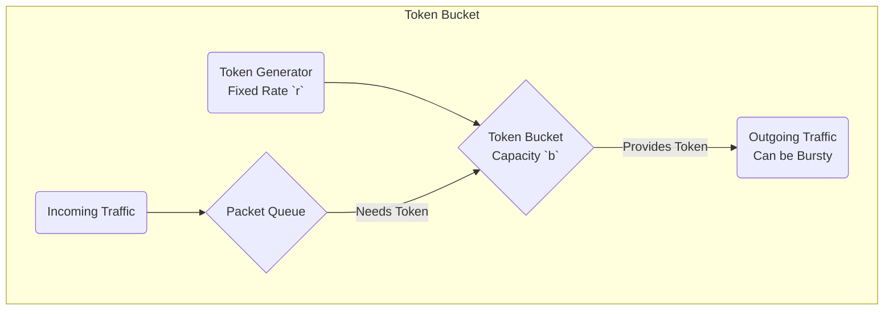

# Traffic Shaping Explained: Leaky Bucket & Token Bucket

**Traffic Shaping** (also known as "packet shaping") is a network management technique that delays some or all datagrams to bring them into compliance with a desired traffic profile. It is used to optimize performance, improve latency, and/or increase usable bandwidth for some kinds of packets by delaying other kinds.

The goal is to regulate the average rate and burstiness of data transmission. The two most famous algorithms for this are the Leaky Bucket and the Token Bucket.

---

## Leaky Bucket Algorithm

**Analogy:** Imagine a bucket with a small hole in the bottom. Water can be poured into the bucket in bursts, but it can only leak out through the hole at a constant rate. If you pour water in too fast, the bucket will overflow and water (packets) will be lost.

**Mechanism:**
1.  The network sends packets into a finite-sized queue (the bucket).
2.  The queue has a single "leak" (the output), which transmits packets at a fixed, constant rate, regardless of how fast they arrive.
3.  If the bucket is full when a new packet arrives, the packet is discarded.

**Diagram:**
```mermaid
graph TD
    subgraph Leaky Bucket
        direction LR
        A(Incoming Traffic<br>Bursty/Variable Rate) --> B{Queue (Bucket)}
        B --> C(Outgoing Traffic<br>Fixed/Constant Rate)
        D(Packets Dropped<br>if Bucket is Full)
        B -- if full --> D
    end
```

**Key Characteristics:**
*   **Output Rate:** Always constant. It smooths out bursty traffic into a steady stream.
*   **Packet Loss:** Packets are dropped if the queue is full.
*   **No Bursts Allowed:** Even if the network is free and the bucket is full of data, the output rate never increases. This is a major drawback.
*   **Simple to Implement:** It's a very straightforward algorithm.

---

## Token Bucket Algorithm

**Analogy:** Imagine a bucket that collects "tokens," which are generated at a constant rate. To send a packet, you must remove one token from the bucket. If there are no tokens, you must wait for one to be generated. You can save up tokens to send a burst of packets later.

**Mechanism:**
1.  A "token generator" creates tokens at a fixed rate (`r`) and adds them to a bucket with a fixed capacity (`b`).
2.  To transmit a packet, the router must have a token. It consumes one token per packet.
3.  If the bucket is empty, the router must wait for a new token to be generated.
4.  If the bucket is full of tokens, newly generated tokens are discarded.

**Diagram:**


**Key Characteristics:**
*   **Allows Bursts:** If the bucket has saved up `b` tokens, the router can send a burst of `b` packets at once, at the maximum speed of the network interface. This is the key advantage over the Leaky Bucket.
*   **Regulates Average Rate:** Over the long term, the output rate is limited by the rate at which tokens are generated (`r`).
*   **Flexible:** It allows for short-term bursts while controlling the long-term average rate.
*   **Two Parameters:** It is controlled by both the token generation rate (`r`) and the bucket capacity (`b`), making it more flexible than the Leaky Bucket.

---

## Comparison Summary

| Feature | Leaky Bucket | Token Bucket |
| :--- | :--- | :--- |
| **Primary Goal** | Enforce a constant output rate. | Control the long-term average rate while allowing short bursts. |
| **Bursts** | Does not allow bursts. | Allows bursts up to the size of the token bucket. |
| **Packet Handling** | Packets are queued. If the queue is full, packets are dropped. | If tokens are available, packets are sent. If not, they are queued or dropped. |
| **Flexibility** | Inflexible. Output is always a fixed rate. | Flexible. Allows for variable output rates depending on token availability. |
| **Use Case** | Best for networks that require a strict, constant data flow (e.g., some real-time services). | Best for most modern data networks where short bursts are common and desirable (e.g., web browsing). |
