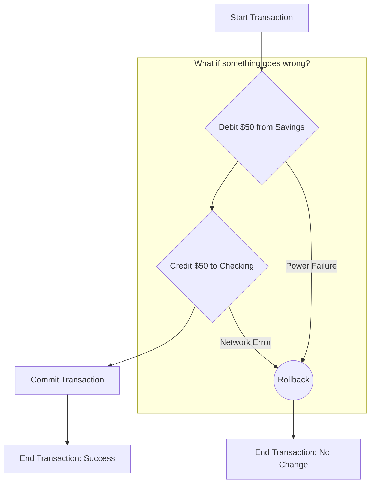

# ACID Properties Explained

ACID is an acronym that stands for **Atomicity, Consistency, Isolation, and Durability**. These are four properties of database transactions that are designed to guarantee data validity even in the event of errors, power failures, or other mishaps.

A **transaction** is a single logical unit of work that can be composed of multiple operations. The classic example is transferring money from one bank account to another.

---

## The Bank Transfer Example

Imagine you want to transfer $50 from your Savings account to your Checking account. This transaction consists of two separate operations:

1. **Debit**: Subtract $50 from your Savings account.
2. **Credit**: Add $50 to your Checking account.

For the database to remain in a valid state, both of these operations must complete successfully. This is where the ACID properties come in.

---

## 1. Atomicity (All or Nothing)

**The Rule**: A transaction is **atomic**, meaning it is an indivisible unit. Either all of its operations are executed, or none of them are. There is no partial completion.

- **In our example**: The transfer must be all or nothing. You cannot have a situation where $50 is debited from Savings but not credited to Checking. If the credit operation fails for any reason (e.g., a power failure), the entire transaction is **rolled back**, and the $50 debit from Savings is undone.

- **Simple Analogy**: An atom was once thought to be the smallest, indivisible particle. A transaction is like an atom in this sense.

---

## 2. Consistency (Valid State to Valid State)

**The Rule**: A transaction must bring the database from one valid state to another. Any data written to the database must be valid according to all defined rules, including constraints, cascades, and triggers.

- **In our example**: Let's say the total money in both accounts is $500 before the transfer. After the transfer is complete, the total money must still be $500. The transaction doesn't create or destroy money. If the transaction were to finish and the total was $450, the database would be in an inconsistent (invalid) state.

- **Simple Analogy**: It's like balancing a checkbook. Every transaction must keep the books balanced.

---

## 3. Isolation (Transactions Don't Interfere)

**The Rule**: The concurrent execution of transactions must result in a system state that would be obtained if transactions were executed serially (one after another). Each transaction should feel like it is the only one running.

- **In our example**: Imagine at the exact same time you are transferring $50, another transaction is running to calculate the total balance of all your accounts for a credit check. The **isolation** property ensures that this second transaction will see either the state _before_ your transfer (total $500) or the state _after_ your transfer (total $500), but not some inconsistent state in the middle (e.g., after the debit but before the credit, where the total would appear as $450).

- **Simple Analogy**: It's like two people editing the same document. Isolation prevents them from overwriting each other's changes randomly. One person's changes are saved completely before the other person's changes are applied.

---

## 4. Durability (Committed Data is Permanent)

**The Rule**: Once a transaction has been **committed** (completed successfully), its changes are permanent and will survive any subsequent system failure, such as a power outage or crash.

- **In our example**: Once the bank's system confirms that your $50 transfer is complete, that money is permanently moved. If the database server crashes one second later, the record of your transfer will still be there when it reboots. The changes are saved to non-volatile memory (like a hard disk).

- **Simple Analogy**: Once you save a file to your hard drive, you expect it to be there when you turn your computer back on. Durability provides the same guarantee for database transactions.
