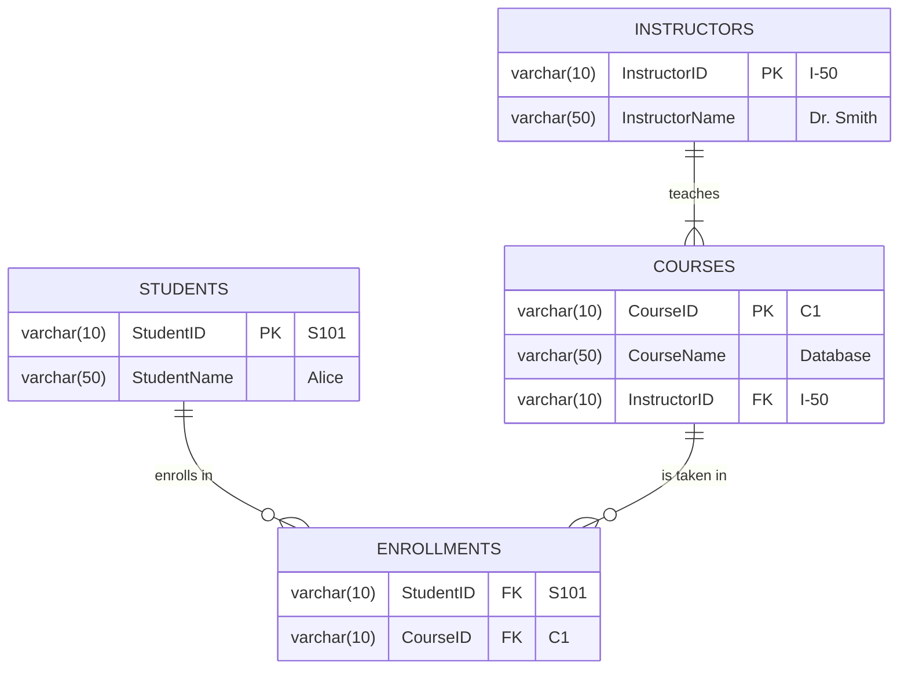

# Normalization and Functional Dependencies Explained

Normalization is the process of organizing columns and tables in a database to minimize data redundancy (repetition) and prevent data anomalies (errors). The goal is to make sure data is stored logically and efficiently.

---

## 1. Why Do We Need Normalization? The Problem of Anomalies

When a table is not normalized, you can run into three types of problems called anomalies.

Let's consider a poorly designed table:

| StudentID | StudentName | CourseID | CourseName    | InstructorName |
| :-------- | :---------- | :------- | :------------ | :------------- |
| S101      | Alice       | C1       | Database      | Dr. Smith      |
| S101      | Alice       | C2       | Operating Sys | Dr. Jones      |
| S102      | Bob         | C1       | Database      | Dr. Smith      |

This table has the following issues:

- **Insertion Anomaly**: You cannot add a new student until they enroll in a course. For example, you can't add a new student "Charlie" with ID "S103" if he hasn't chosen a course yet, because `CourseID` would be empty.
- **Deletion Anomaly**: If you delete a student's only course, you might accidentally delete the student's entire record. If Bob (S102) drops the Database course, his entire row is deleted, and we lose all information about Bob.
- **Update Anomaly**: If an instructor's name changes, you have to update it in multiple rows. If Dr. Smith changes his name, we have to find every single record where he is listed and update it. If we miss one, the data becomes inconsistent.

---

## 2. Functional Dependencies (FD)

A functional dependency is the core concept behind normalization. It's a relationship between attributes.

> If `A -> B` (read as "A determines B"), it means that for a given value of attribute A, there is only **one** corresponding value of attribute B.

In our example table:

- `StudentID -> StudentName` (Correct: For a given StudentID like 'S101', the name is always 'Alice').
- `CourseID -> CourseName` (Correct: For a given CourseID like 'C1', the name is always 'Database').
- `CourseID -> InstructorName` (Correct: 'C1' is always taught by 'Dr. Smith').
- `StudentName -> StudentID` (This may not be true if two students have the same name).

---

## 3. The Normal Forms (Step-by-Step)

### Step 1: First Normal Form (1NF)

**Rule**: Each cell in the table must hold a single, atomic (indivisible) value. There should be no repeating groups.

Our example table is already in 1NF because every cell has only one value. An un-normalized table might look like this:

| StudentID | StudentName | Courses (CourseID, CourseName) |
| :-------- | :---------- | :----------------------------- |
| S101      | Alice       | (C1, Database), (C2, OS)       |

To make it 1NF, we flatten it, which results in the table we started with.

### Step 2: Second Normal Form (2NF)

**Rule**: The table must be in 1NF, and every non-key attribute must be **fully dependent** on the entire primary key. This rule applies to tables with a composite primary key (a key made of two or more columns).

1. **Find the Primary Key**: In our example table, neither `StudentID` nor `CourseID` alone can uniquely identify a row. But together, `(StudentID, CourseID)` can. So, the primary key is `{StudentID, CourseID}`.

2. **Check for Partial Dependencies**: A partial dependency is when a non-key attribute depends on only a _part_ of the composite primary key.

   - `StudentName` depends only on `StudentID` (`StudentID -> StudentName`). This is a **partial dependency**.
   - `CourseName` and `InstructorName` depend only on `CourseID` (`CourseID -> CourseName`, `CourseID -> InstructorName`). This is also a **partial dependency**.

3. **Decompose the Table**: To fix this, we split the table into smaller tables, separating the partial dependencies.

**Table 1: Students**

| StudentID (PK) | StudentName |
| :------------- | :---------- |
| S101           | Alice       |
| S102           | Bob         |

**Table 2: Courses**

| CourseID (PK) | CourseName    | InstructorName |
| :------------ | :------------ | :------------- |
| C1            | Database      | Dr. Smith      |
| C2            | Operating Sys | Dr. Jones      |

**Table 3: Enrollments**

| StudentID (FK) | CourseID (FK) |
| :------------- | :------------ |
| S101           | C1            |
| S101           | C2            |
| S102           | C1            |

Now, all tables are in 2NF. The anomalies are solved!

### Step 3: Third Normal Form (3NF)

**Rule**: The table must be in 2NF, and there should be no **transitive dependencies**.

> A transitive dependency is when a non-key attribute depends on another non-key attribute. `A -> B -> C`, where A is the key, and B and C are non-key attributes.

Let's look at our `Courses` table from the 2NF step.

- The primary key is `CourseID`.
- `CourseID -> InstructorName`.
- But wait, `CourseID -> CourseName`, and `CourseName` could also determine the `InstructorName` if we assume a course is only taught by one instructor. Let's refine our example and assume `InstructorID` exists.

Consider this table instead:
**Courses_Temp (in 2NF)**

| CourseID (PK) | CourseName | InstructorID | InstructorName |
| :------------ | :--------- | :----------- | :------------- |
| C1            | Database   | I-50         | Dr. Smith      |
| C2            | OS         | I-51         | Dr. Jones      |

Here:

- `CourseID` is the primary key.
- `CourseID -> InstructorID`.
- `InstructorID -> InstructorName`.
  This is a **transitive dependency** because `InstructorName` (non-key) depends on `InstructorID` (non-key).

**Decompose the Table**: We split it further to remove the transitive dependency.

**Table 2a: Courses**

| CourseID (PK) | CourseName | InstructorID (FK) |
| :------------ | :--------- | :---------------- |
| C1            | Database   | I-50              |
| C2            | OS         | I-51              |

**Table 2b: Instructors**

| InstructorID (PK) | InstructorName |
| :---------------- | :------------- |
| I-50              | Dr. Smith      |
| I-51              | Dr. Jones      |

---

## Final Normalized Structure (in 3NF)

Here is a Mermaid diagram showing our final, clean database structure.

By normalizing the data, we have eliminated redundancy and the anomalies, creating a robust and logical database design.
