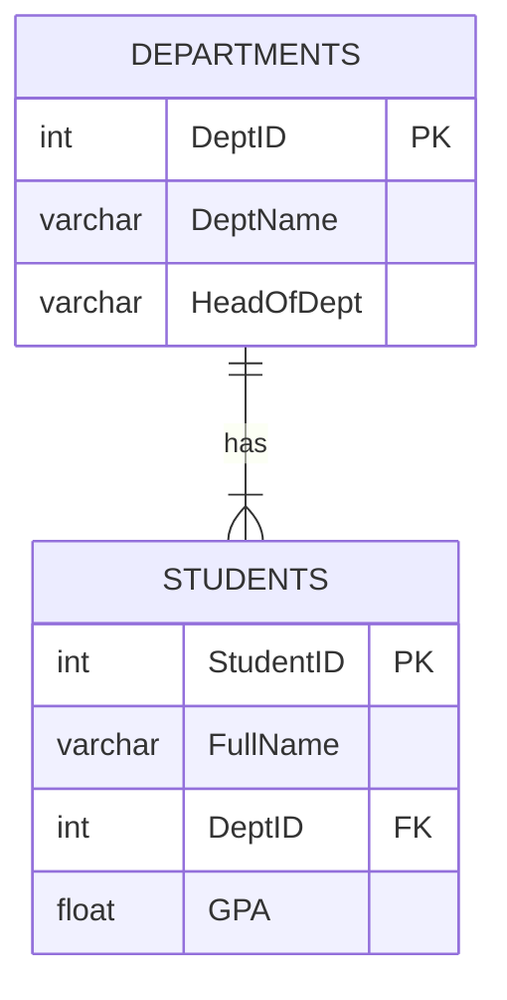

# SQL Queries: The Practical Guide

SQL (Structured Query Language) is used to communicate with a database. For your exam, you need to master three main concepts: selecting data, joining tables, and grouping data.

---

## The Example Schema

Let's use a simple university database with two tables: `Students` and `Departments`.

**Table: `Students`**

| StudentID | FullName | DeptID | GPA |
| :-------- | :------- | :----- | :-- |
| 1         | Alice    | 101    | 3.8 |
| 2         | Bob      | 102    | 3.2 |
| 3         | Charlie  | 101    | 3.5 |
| 4         | Diana    | 103    | 3.9 |
| 5         | Eve      | 102    | 2.8 |

**Table: `Departments`**

| DeptID | DeptName         | HeadOfDept   |
| :----- | :--------------- | :----------- |
| 101    | Computer Science | Dr. Smith    |
| 102    | Electrical Eng.  | Dr. Jones    |
| 103    | Mechanical Eng.  | Dr. Williams |



---

## 1. Selecting Data (`SELECT`)

The `SELECT` statement is used to query the database and retrieve data that matches criteria that you specify.

### Basic `SELECT`

This retrieves specific columns from a table.

**Query**: Get the full name and GPA of all students.

```sql
SELECT FullName, GPA
FROM Students;
```

**Result**:

| FullName | GPA |
| :------- | :-- |
| Alice    | 3.8 |
| Bob      | 3.2 |
| Charlie  | 3.5 |
| Diana    | 3.9 |
| Eve      | 2.8 |

### `SELECT` with `WHERE`

The `WHERE` clause is used to filter records and extract only those that fulfill a specified condition.

**Query**: Get the students who have a GPA greater than 3.4.

```sql
SELECT FullName, GPA
FROM Students
WHERE GPA > 3.4;
```

**Result**:

| FullName | GPA |
| :------- | :-- |
| Alice    | 3.8 |
| Charlie  | 3.5 |
| Diana    | 3.9 |

### `SELECT` with `ORDER BY`

The `ORDER BY` keyword is used to sort the result-set in ascending or descending order.

**Query**: Get all students, ordered by their GPA from highest to lowest.

```sql
SELECT FullName, GPA
FROM Students
ORDER BY GPA DESC;
```

**Result**:

| FullName | GPA |
| :------- | :-- |
| Diana    | 3.9 |
| Alice    | 3.8 |
| Charlie  | 3.5 |
| Bob      | 3.2 |
| Eve      | 2.8 |

---

## 2. Joining Tables (`INNER JOIN`)

The `INNER JOIN` keyword selects records that have matching values in both tables. It's the most common way to combine data from multiple tables.

**Query**: Get the full name of each student and the name of their department.

To do this, we need to "join" the `Students` table with the `Departments` table using their common column, `DeptID`.

```sql
SELECT S.FullName, D.DeptName
FROM Students AS S
INNER JOIN Departments AS D ON S.DeptID = D.DeptID;
```

- `AS S` and `AS D` are aliases, which are temporary, shorter names for the tables to make the query easier to read.
- `ON S.DeptID = D.DeptID` is the join condition. It tells SQL how to match rows from the two tables.

**Result**:

| FullName | DeptName         |
| :------- | :--------------- |
| Alice    | Computer Science |
| Bob      | Electrical Eng.  |
| Charlie  | Computer Science |
| Diana    | Mechanical Eng.  |
| Eve      | Electrical Eng.  |

---

## 3. Grouping Data (`GROUP BY` and Aggregate Functions)

Aggregate functions perform a calculation on a set of values and return a single value. The `GROUP BY` statement groups rows that have the same values into summary rows.

Common aggregate functions:

- `COUNT()`: Counts the number of rows.
- `AVG()`: Calculates the average value.
- `SUM()`: Calculates the sum of values.
- `MAX()`: Returns the largest value.
- `MIN()`: Returns the smallest value.

**Query**: Find the number of students in each department.

```sql
SELECT D.DeptName, COUNT(S.StudentID) AS NumberOfStudents
FROM Students AS S
INNER JOIN Departments AS D ON S.DeptID = D.DeptID
GROUP BY D.DeptName;
```

- `COUNT(S.StudentID)` counts the students.
- `GROUP BY D.DeptName` tells the database to perform this count for each unique department name separately.

**Result**:

| DeptName         | NumberOfStudents |
| :--------------- | :--------------- |
| Computer Science | 2                |
| Electrical Eng.  | 2                |
| Mechanical Eng.  | 1                |

**Another Example**: Find the average GPA for each department.

```sql
SELECT D.DeptName, AVG(S.GPA) AS AverageGPA
FROM Students AS S
INNER JOIN Departments AS D ON S.DeptID = D.DeptID
GROUP BY D.DeptName;
```

**Result**:

| DeptName         | AverageGPA |
| :--------------- | :--------- |
| Computer Science | 3.65       |
| Electrical Eng.  | 3.0        |
| Mechanical Eng.  | 3.9        |
