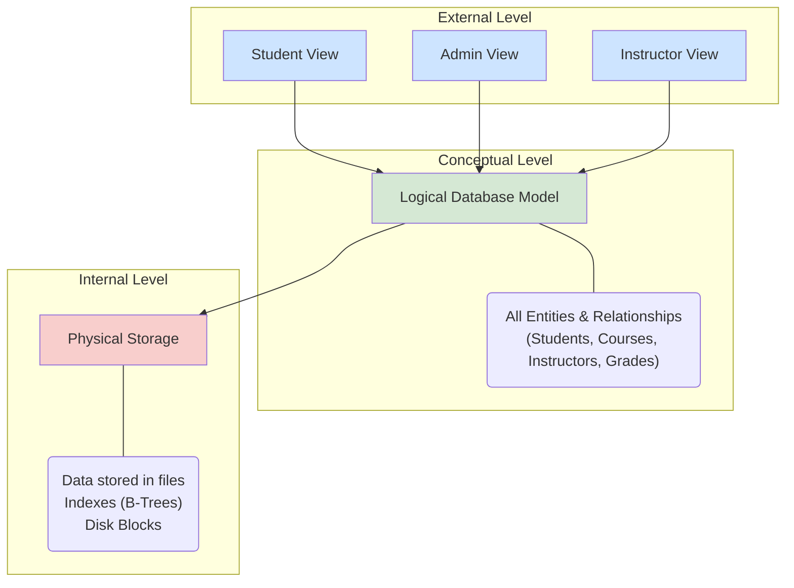

# The Three-Schema Architecture Explained

The Three-Schema Architecture is a framework for designing databases that separates the user's view of the database from the physical way it is stored. The goal is to provide **data independence**, which means you can change how the data is stored without affecting the users, and vice-versa.

It divides a database into three levels or "schemas":

1. **External Schema** (User View)
2. **Conceptual Schema** (Logical View)
3. **Internal Schema** (Physical View)

---

## The Three Levels

Let's use a university database as an example to understand each level.

### 1. External Schema (User Views)

This is the highest level of database abstraction, which describes the part of the database that a specific user group is interested in. It hides the rest of the database from that user group.

- **What it is**: A collection of different "views" for different users.
- **Example**:
  - A **Student View** might only show their own courses, grades, and personal details. They cannot see other students' grades or faculty salaries.
  - An **Instructor View** might show the courses they teach and the students enrolled in them, but not the university's financial records.
  - An **Admin View** might see all student data, all courses, and all financial information.
- **Analogy**: It's like the main menu of a banking app. You only see options relevant to you (your balance, transfers), not the options for the bank manager.

### 2. Conceptual Schema (Logical View)

This is the "big picture" view of the database. It describes the logical structure of the entire database for a community of users. It defines all the entities, their attributes, and the relationships between them.

- **What it is**: The blueprint of the database. It specifies _what_ data is stored and _how_ that data is related, without getting into the details of how it is physically stored.
- **Example**: For the university database, the conceptual schema would define:
  - Entities like `Students`, `Courses`, `Instructors`, `Departments`.
  - Attributes for each entity (e.g., `Students` have `StudentID`, `Name`, `GPA`).
  - Relationships between entities (e.g., "A `Student` enrolls in a `Course`," "An `Instructor` teaches a `Course`").
- **Analogy**: It's the architect's complete blueprint for a house, showing all the rooms, doors, and windows and how they connect.

### 3. Internal Schema (Physical View)

This is the lowest level of abstraction, which describes how the data is physically stored on a storage device (like a hard disk).

- **What it is**: The implementation details of the database storage. It deals with data structures, file organization, and access paths (e.g., indexes).
- **Example**: The internal schema would specify:
  - How the `Students` table is stored (e.g., as a file of records).
  - The data types of each field (e.g., `StudentID` is an Integer, `Name` is a String of 50 characters).
  - The presence of indexes (e.g., "Create a B-Tree index on the `StudentID` column to make searches faster").
- **Analogy**: It's the construction plan for the house, detailing the type of bricks, the thickness of the walls, and the electrical wiring paths.

---

## Data Independence

The primary goal of this architecture is to provide data independence.

### 1. Logical Data Independence

This is the ability to change the **conceptual schema** without having to change the external schemas (the user views).

- **Example**: Suppose we add a new attribute to the `Students` table, like `DateOfBirth`. This is a change to the conceptual schema. However, the existing **Student View** or **Instructor View** does not need to be changed. The applications they use will continue to work without any modification.

### 2. Physical Data Independence

This is the ability to change the **internal schema** without having to change the conceptual schema.

- **Example**: A database administrator might decide to change the storage structure of the database to improve performance. For instance, they might change the file organization or add a new index to the `Students` table. This change is at the physical level. It does not affect the logical structure of the data, so neither the conceptual schema nor any of the external user views need to be updated.

This separation makes the database system much more flexible and easier to maintain over time.
