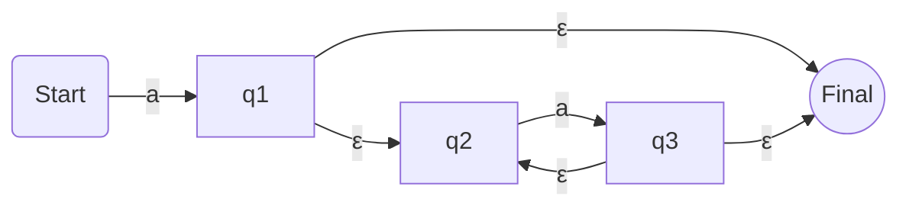
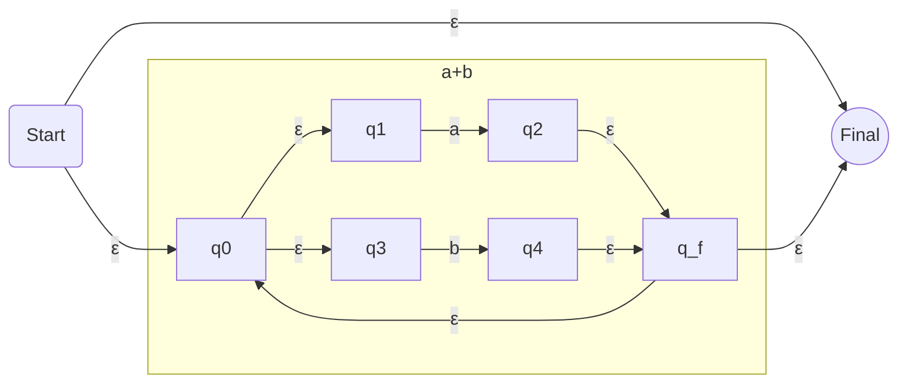
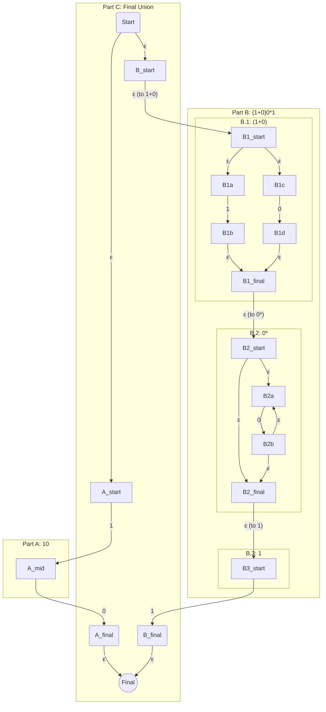

# Thompson's Construction Examples

This file shows the step-by-step process of converting Regular Expressions into NFA with ε-moves using Thompson's Construction. This is the formal, mechanical method you should use in your exam.

---

## Example 1: `aa*`

This expression is a **concatenation** of two parts: `a` and `a*`.

**Step 1: Construct the NFA for the first `a`.**
This is the most basic building block.

**Step 2: Construct the NFA for `a*`.**
This uses the "star" or "Kleene closure" rule on a basic `a` automaton.

**Step 3: Concatenate the two NFAs.**
To concatenate, the final state of the first NFA becomes the start state of the second NFA.

**Final Diagram for `aa*` (Mermaid Syntax):**

---

## Example 2: `(a+b)*`

This expression is the **star operation** applied to a **union** of `a` and `b`.

**Step 1: Construct the NFA for `a+b`.**
This uses the "union" rule on the basic `a` and `b` automatons.

**Step 2: Apply the "star" rule to the entire `a+b` NFA.**
We add a new start state, a new final state, and ε-loops for repetition and for the empty string.

**Final Diagram for `(a+b)*` (Mermaid Syntax):**

---

## Example 3: `10+(1+0)0*1`

This is a complex one. It's a **union** of two concatenated expressions: `10` and `(1+0)0*1`. We build each part separately and then combine them with a final union.

**Final Diagram for `10+(1+0)0*1` (Mermaid Syntax):**

_This diagram shows all the components connected. The subgraphs help organize the complex structure._

